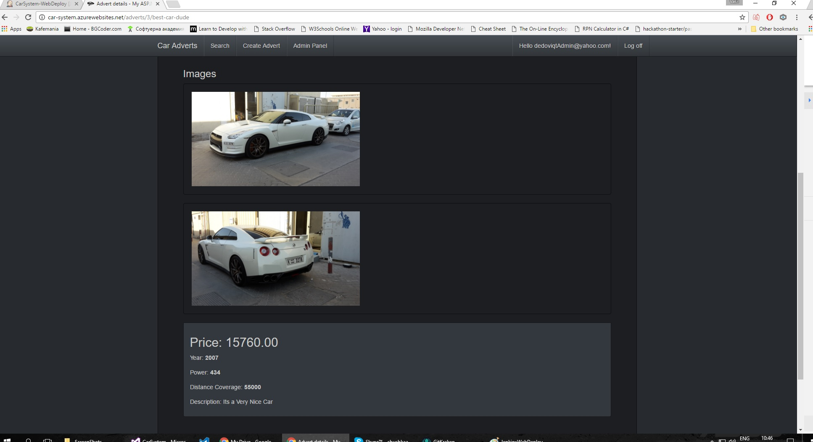
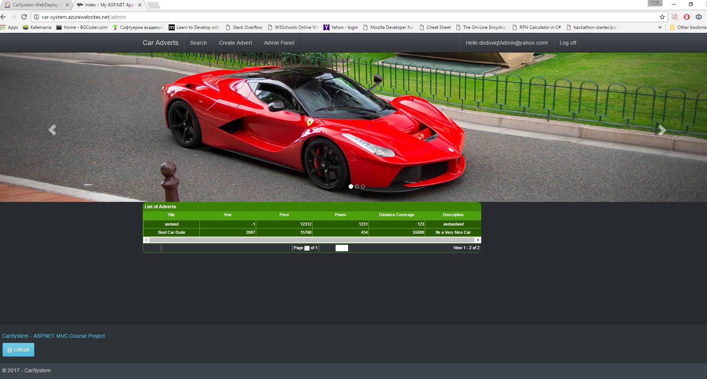
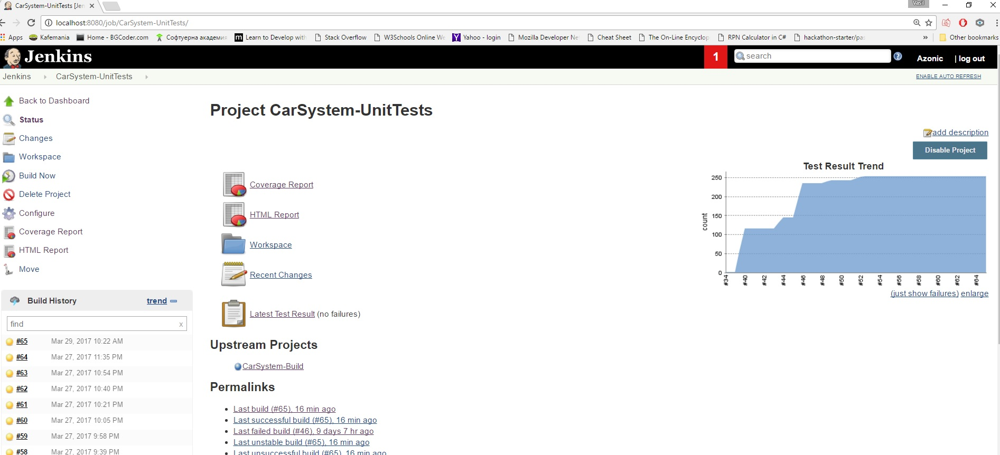

# My-ASP.NET-MVC-Project aka CarSystem

  

<h1 align="center">ASP.NET MVC Course Project</h1>

[Description](https://github.com/TelerikAcademy/ASP.NET-MVC/tree/master/resources/Final%20Project/2017/README.md)

| Name              | Academy Username  |
|-------------------|-------------------|
|Vasil Penev        |__Azonic__         |

# Car System
  - Online Car System for adverts!
-----------------------------------------------------------------------------------------------------------------------

## Functionalities
 - Regular Users can add adverts with Images and search for adverts with detail View.
 - Admin can Manage Adverts with Ajax using JqGrid.
 
-----------------------------------------------------------------------------------------------------------------------

-----------------------------------------------------------------------------------------------------------------------

## ASP.NET MVC course project
  - Ioc container - Ninject 
  - Testing - NUnit, Moq, TestStack.FluentMVCTesting
  - Validation - Bytes2you.Validation
  - ORM - EntityFramework
  - Data base - SQL Server
  - Styles - Bootstrap 
  - Continuous Integration - AppVeyor & Jenkins
  - Continuous Integration and Deployment - Jenkins
  - Code Coverage - Coveralls
  - Hosting - Azure
-----------------------------------------------------------------------------------------------------------------------
## Links

[Azure host link](http://car-system.azurewebsites.net/) |
